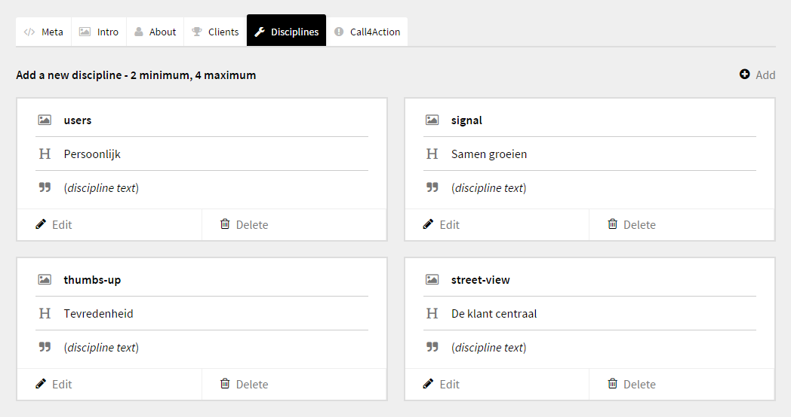

# Kirby - Tabs

**Version 0.0.1 / December, 25th 2015 - intial public offering.**

Divide the back-end of your Kirby 2.2 (or higher) CMS into tabs (sections).

Every tab (section) can have it's own title and icon.

****

### How to install?

1. Unzip the folder ```kirby-tabs``` in ```\site\```.
2. A new field will be created ```\site\fields\tab```.
3. An example blueprint will be installed ```\site\blueprints\tab-example.php```.
4. See the blueprint for a detailed set-up, or check out the code below.

You can add an icon to every tab - check out the Font Awesome cheatsheet for all available icons.

http://fortawesome.github.io/Font-Awesome/cheatsheet/

Or search for an icon:

http://fortawesome.github.io/Font-Awesome/icons/

Simply enter the icons-class-name (without ```fa-```) in the blueprint (```fa-diamond``` will become ```diamond```).

***

####Demo blueprint code

```
fields:

###################################################

sectionSlider:
    label: Slider
    id: slider
    type: tab
    icon: image

  title_slider:
    label: Title
    type: text

  text_slider:
    label: Text
    type: text

###################################################

  sectionFeatures:
    label: Features
    id: features
    type: tab
    icon: diamond

  title_features:
    label: Title
    type: text

  text_features:
    label: Text
    type: text

###################################################    

  sectionWorkflow:
    label: Workflow
    id: workflow
    type: tab
    icon: random

  title_workflow:
    label: Title
    type: text

  text_workflow:
    label: Text
    type: text
```

****


